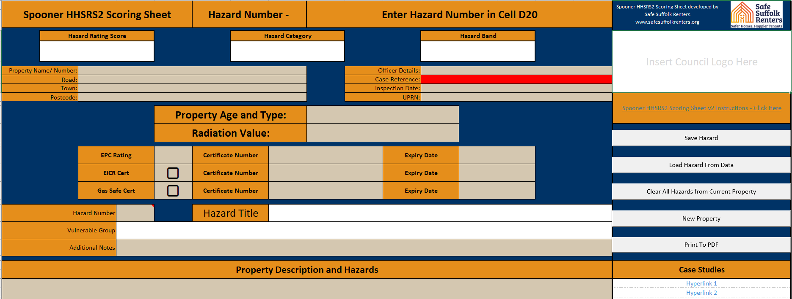

# HHSRS2 (HHSRS 2026) Hazard Scoring Tool (Free Excel)

## 📸 Preview

A macro-enabled Excel tool developed to support Environmental Health Officers in delivering **consistent, transparent hazard scoring under HHSRS2**.

Designed for UK housing professionals preparing for the **June 2026 HHSRS v2 rollout**.

---

## ✅ What this tool does

- Calculates **HHSRS2 hazard scores automatically**
- Assigns **High, Medium, and Low risk bands**
- Supports the **21 consolidated housing hazards**
- Provides a **simple, inspection-ready Excel interface**
- Reduces the need for manual scoring calculations

---

## ✅ Who this is for

- Environmental Health Officers (EHOs)
- Local Authority housing teams
- Private Sector Housing enforcement officers
- Housing surveyors and inspectors
- Regulatory compliance professionals

---

## ✅ Purpose

This tool is designed to ensure a **smooth, consistent transition** between existing HHSRS guidance and HHSRS2.

With limited official tools and case studies currently available, it provides a **practical, real-world solution** for calculating hazard scores during inspections.

---

## 📥 How to Download

👉 Go to the **Releases** section of this repository (next to the preview picture on PC or at the bottom of this readme on Phone) and download the latest version (currently v2.2

⚠️ Always download from the Releases section to ensure you are using the latest version.

---

## ⚠️ Important Information (Macros)

- This spreadsheet contains **macros (required for scoring calculations)**  
- You will need to **enable macros** when opening the file  
- No external data connections are included  

### If the file is blocked:

1. Right-click the downloaded file  
2. Select **Properties**  
3. Tick **Unblock**  
4. Click **Apply**  
5. Open the file and click **Enable Macros**

---

## ✅ Key Features

- ✅ Automated hazard scoring calculations  
- ✅ HHSRS2-compatible structure  
- ✅ Consistent risk banding outputs  
- ✅ Designed for field-based inspections  
- ✅ Fully offline Excel tool (no subscription required)  

---

## ✅ How this helps with HHSRS2

This tool helps address current gaps by:

- Providing a **consistent scoring approach**
- Supporting **risk band calculation without full case study availability**
- Enabling officers to apply **structured hazard assessments in practice**

---

## ✅ Version

**v2.2 – Final edit before Case Studies are released**

## 📘 Instructions

User guidance is available in the `/instructions` folder within this repository.
``

---

## 🔍 Keywords 

HHSRS2 scoring sheet, HHSRS calculator Excel, housing hazard scoring tool, environmental health risk bands, UK housing inspections, HHSRS v2 tool, housing health and safety rating system calculator

---

## 🤝 Feedback

For any questions, feedback, or suggestions, feel free to get in touch or raise an issue on this repository.

---

## ⚖️ Disclaimer

This tool is intended to support professional judgement for those HHSRS trained and does not replace official guidance or statutory requirements.
